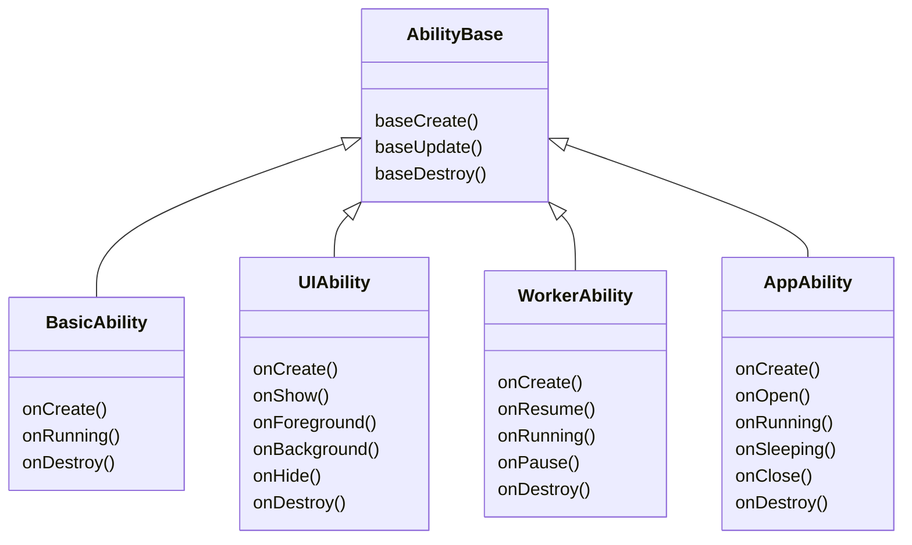
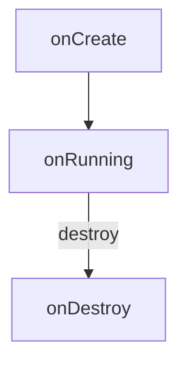
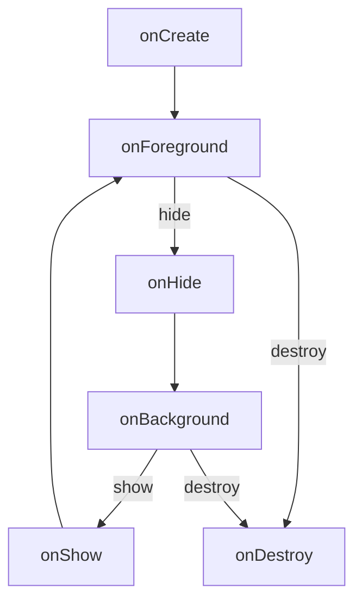
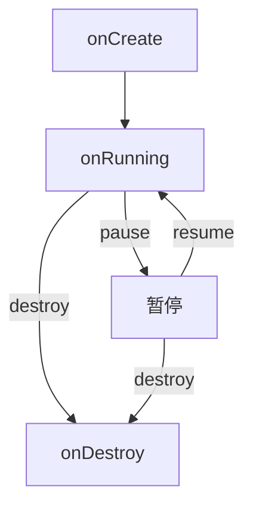
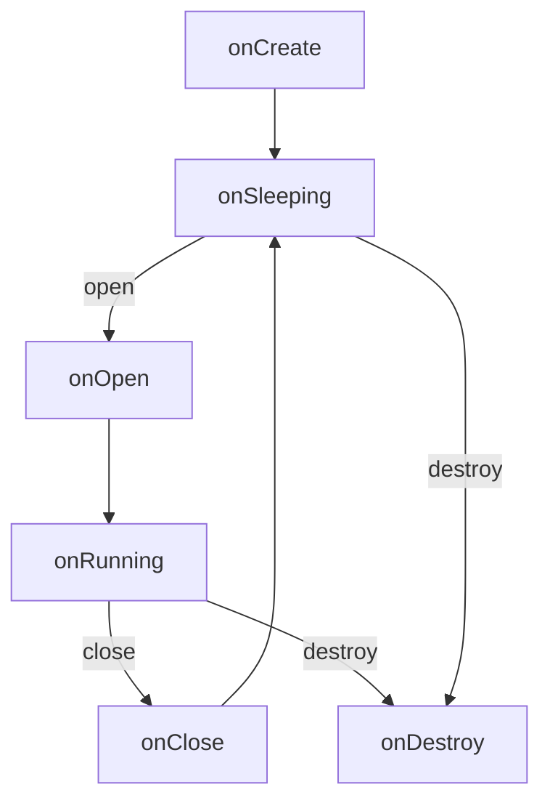

# Mooncake

适用于单片机的多 App 管理调度框架

A multi-app management and scheduling framework designed for mcu

------

- 结构化 App 生命周期设计
- 多 App 管理
- 可扩展的生命周期行为管理

简单使用：

```cpp
// 派生一个 App
class MyApp : public AppAbility {
public:
    MyApp()
    {
        printf("[MyApp] on construct\n");
    }

    // 重写生命周期回调函数
    void onOpen() override
    {
        printf("[MyApp] on open\n");
    }
    void onRunning() override
    {
        printf("[MyApp] on running\n");
    }
};

Mooncake mc;

// 安装 App
auto my_app_id = mc.installApp(std::make_unique<MyApp>());
// 输出：
// [MyApp] on construct

// 打开 App
mc.openApp(my_app_id);

// 更新 Mooncake
for (int i = 0; i < 6; i++) {
    mc.update();
}
// 输出：
// [MyApp] on open
// [MyApp] on running
// [MyApp] on running
// [MyApp] on running
// [MyApp] on running
// [MyApp] on running
// ...
```

App 具体生命周期[图表](https://github.com/Forairaaaaa/mooncake?tab=readme-ov-file#appability)

## API

常用管理接口：

### 安装

```cpp
/**
 * @brief 安装 App，返回 App ID
 *
 * @param appAbility
 * @return int
 */
int installApp(std::unique_ptr<AppAbility> appAbility);
```

### 卸载
```cpp
/**
 * @brief 卸载指定 ID 的 App
 *
 * @param appID
 * @return true
 * @return false
 */
bool uninstallApp(int appID);

/**
 * @brief 卸载所有 App
 *
 */
void uninstallAllApps();
```

### 打开、关闭

```cpp
/**
 * @brief 打开指定 ID 的 App
 *
 * @param appID
 * @return true
 * @return false
 */
bool openApp(int appID);

/**
 * @brief 关闭指定 ID 的 App
 *
 * @param appID
 * @return true
 * @return false
 */
bool closeApp(int appID);
```

### App 信息
```cpp
/**
 * @brief 获取当前 App 数量
 *
 * @return std::size_t
 */
std::size_t getAppNum();

/**
 * @brief 获取指定 ID 的 App 信息
 *
 * @param appID
 * @return AppAbility::AppInfo_t
 */
AppAbility::AppInfo_t getAppInfo(int appID);

/**
 * @brief 获取所有 App 的 App 信息
 *
 * @return std::vector<AppAbility::AppInfo_t>
 */
std::vector<AppAbility::AppInfo_t> getAllAppInfo();
```

### 更新

App 的所有生命周期回调都会集中在 Mooncake 的  `update()` 方法中触发：

```cpp
/**
 * @brief 更新 Mooncake，刷新 App 及 Extension 状态，触发生命周期回调
 *
 */
void update();
```

一般可以丢进 `while` 里

### 线程安全性

所有 API 都为线程 **不安全**，Mooncake 只提供管理器和一个集中的 `update()` 调度接口

如果需要线程安全，确保 Mooncake 在临界区：

```cpp
// 一边
while (1) {
    mutex.lock();
    mc.update();
    mutex.unlock();
}

// 另一边
mutex.lock();
mc.openApp(114514);
mutex.unlock();
```

## Ability 模型

这概念抄[鸿蒙](https://docs.openharmony.cn/pages/v4.1/zh-cn/application-dev/application-models/abilitykit-overview.md)的，有点像超级青春版

**Ability** 为一个应用的行为抽象，每个 Ability 都会有最基础的 **创建、运行、销毁** 三个状态

基于这三个状态，可以派生出不同生命周期的 Ability 类型



### BasicAbility

 `BasicAbility` 类型生命周期：



提供了最简单的三段式生命周期，可以把 `onCreate` 比作 **Arduino** 的 `setup`，`onRunning` 比作 `loop` 

### UIAbility

 `UIAbility` 类型生命周期：



扩展出前后台概念，创建之后默认为前台状态，可由 `hide` 和 `show` 接口切换

适合需要前后台概念的 UI 行为

### WorkerAbility

 `WorkerAbility` 类型生命周期：



扩展出运行和暂停两个状态，创建之后默认为运行状态，可由 `pause` 和 `resume` 接口切换

适合后台运行的行为，比如数据监听和事件转发

### AppAbility

 `AppAbility` 类型生命周期：



扩展出打开和关闭概念，创建后默认为关闭状态（sleeping），可由 `open` 和 `close` 接口切换状态

Mooncake 框架所管理的 App 就是基于 `AppAbility` 类型

所以只要继承 `AppAbility` 类型，重写生命周期回调，就可以实现我们自己的 App 了：

```cpp
class MyApp_1 : public AppAbility {
public:
    void onOpen() override
    {
        // 上号
    }
    void onRunning() override
    {
        // 大乱斗
    }
    void onClose() override
    {
        // 耻辱下播
    }
};

class MyApp_2 : public AppAbility {
public:
    void onOpen() override
    {
        // 去自习室
    }
    void onRunning() override
    {
        // 钓鱼
    }
    void onClose() override
    {
        // 回宿舍
    }
};
```

还提供 App 信息和接口：

```cpp
struct AppInfo_t {
    std::string name;
    void* icon = nullptr;
    void* userData = nullptr;
};

const AppInfo_t& getAppInfo();
AppInfo_t& setAppInfo();
```

适合有 App 信息需求的多应用行为

## Mooncake

**Mooncake** 内部提供两个 **Ability** 管理器：

```cpp
std::unique_ptr<AbilityManager> _app_ability_manager;
std::unique_ptr<AbilityManager> _extension_ability_manager;
```

- **App Ability 管理器** 只用于管理  `AppAbility` 类型，一个 `AppAbility`  对于 Mooncake 框架来说就是一个 **App** ，Mooncake 提供了针对性的接口封装

- **Extension Ability 管理器** 可以用于管理任意 Ability 类型，比如需要一些 `WorkerAbility` 来监听数据、`UIAbility` 渲染图像、自己派生的 `CustomAbility` 等都可以丢到这里统一由 Mooncake 管理

比如：

```cpp
// 创建 Mooncake
Mooncake mc;

// 安装 App
printf(">> install app\n");
mc.installApp(std::make_unique<MyApp>());
// 输出：
// >> install app
// [app] on construct

// 安装扩展
printf(">> install extensions\n");
mc.ExtensionManager()->createAbility(std::make_unique<MyWorker>());
mc.ExtensionManager()->createAbility(std::make_unique<MyUI>());
// 输出：
// >> install extensions
// [worker] on construct
// [ui] on construct

// 更新 Mooncake
printf(">> update mooncake\n");
for (int i = 0; i < 3; i++) {
    mc.update();
}
// 输出：
// >> update mooncake
// [worker] on running
// [ui] on foreground
// [app] on running
// [worker] on running
// [ui] on foreground
// [app] on running
// [worker] on running
// [ui] on foreground
```

### AbilityManager

**Ability 管理器** 负责 Ability 实例的创建、储存和销毁，以及原始生命周期的调度触发

每个 Ability 实例会分配一个 **Ability ID**，方便查找索引：

```cpp
/**
 * @brief 创建 Ability，返回 Ability ID
 *
 * @param ability
 * @return int
 */
int createAbility(std::unique_ptr<AbilityBase> ability);

/**
 * @brief 销毁指定 ID 的 Ability
 *
 * @param abilityID
 * @return true
 * @return false
 */
bool destroyAbility(int abilityID);
```

**Ability ID** 并不是绝对唯一的，当一个 Ability 被销毁时，对应的 ID 会被 **回收**，等待分配到新的 Ability

AbilityManager 还提供针对性的 Ability 操作接口，简化 Ability 状态切换，避免直接的实例操作：

```cpp
/* -------------------------------------------------------------------------- */
/*                            Ability API Wrapping                            */
/* -------------------------------------------------------------------------- */
// 对外暴露针对性的 Ability 操作接口

bool showUIAbility(int abilityID);
bool hideUIAbility(int abilityID);
UIAbility::State_t getUIAbilityCurrentState(int abilityID);

bool pauseWorkerAbility(int abilityID);
bool resumeWorkerAbility(int abilityID);
WorkerAbility::State_t getWorkerAbilityCurrentState(int abilityID);

bool openAppAbility(int abilityID);
bool closeAppAbility(int abilityID);
AppAbility::AppInfo_t getAppAbilityAppInfo(int abilityID);
AppAbility::State_t getAppAbilityCurrentState(int abilityID);
```

